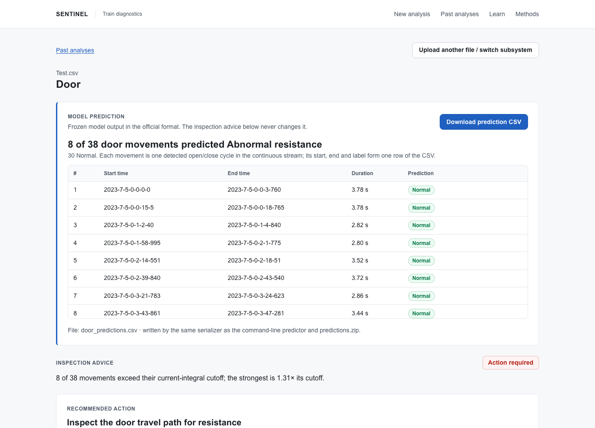
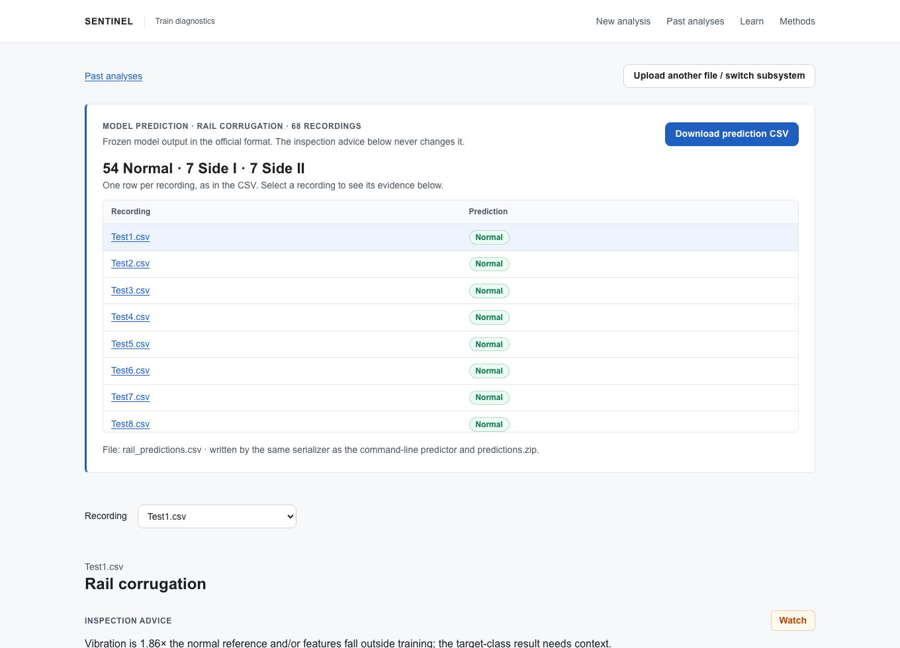

# SENTINEL — Train Condition Monitoring

**NebulaX 2026 Hackathon · Problem Statement 3.** SENTINEL is one web app that diagnoses all four rail-vehicle subsystems from raw sensor recordings: **Door**, **ACV** (air conditioning), **Rail corrugation** and **SHM** (structural fatigue). You drop in a recording. The app checks the file, runs a frozen, validated model, and shows the prediction in the official format with a download button. It then explains the evidence behind it and suggests what to inspect next.



## Project highlights

- One end-to-end application for four train subsystems, from sensor-file validation to model inference, evidence charts, and downloadable results.
- Python signal processing and machine learning served through FastAPI, with a Next.js and TypeScript interface.
- Reproducible model artifacts, documented local validation, and matching app/CLI prediction exports.

[Run locally](#quick-start) · [Validation results](#results-local-validation) · [Methodology](docs/METHODOLOGY.md) · [Model limitations](#limitations)

## Results (local validation)

These scores come from validation on the **training** data, with leak-free splits. They are not organizer scores; the organizers hold the test labels.

| Subsystem | Frozen method | Official metric | Local score | Simple baseline | Validation |
|---|---|---|---|---|---|
| Door | Gap segmentation → direction vote → motor-current integral judged **relative to the recording's own baseline** | IoU-weighted F1 | **0.991** | Fixed absolute cutoff: 0.991, but it falls to 0.711 under synthetic door shifts (ours stays 0.991) | 5 contiguous time blocks, full pipeline |
| ACV | Cabin temperature minus the median of the other cooling cars, over settled cooling (no fitted weights) | Rank-decay | **0.979** | 0.563 (random ranking) | Leave-one-case-out (6 cases) |
| Rail | Random Forest fault detector + Extra Trees side model, speed features excluded | Macro F1 | **0.793** speed-matched (0.810 full) | 0.308 (all Normal) | Stratified folds grouped by file hash × 5 seeds |
| SHM | Rainflow counting + fitted fatigue power law, D = c·Σ nᵢ·rangeᵢ⁵ | max(0, 1 − MAPE) | **0.975** | 0.417 (best constant) | Leave-one-file-out (64 files) |

The local overall score is **0.934**, the mean of the four. Details and limitations: [methodology](docs/METHODOLOGY.md), [model cards](artifacts/ps3), [EDA reports](reports/eda/) (HTML files; download and open in a browser), [split manifest with file hashes](reports/validation/split_manifest.json).

## Quick start

**Requirements:** Python 3.13+, Node.js 22+ and npm. Tested on macOS (Apple silicon).

```bash
./run.sh            # installs dependencies on first run, then opens http://localhost:3000
./run.sh --stop     # stop it (or press Ctrl+C)
```

On first run, the launcher creates a Python virtual environment, installs the pinned packages and builds the web app. It never retrains a model or generates data.

**Official data (needed for batch analysis and building the bundle).** Clone the organizers' repository into the project folder as `NebulaX-Hackathon-ProblemStatement/`, or point to its dataset folder:

```bash
SENTINEL_DATASET_ROOT=/path/to/PS3/02_Datasets ./run.sh
```

### Using the app

1. **New analysis.** Drag a recording onto the page, or choose a file. CSV works for all four subsystems, and `.xlsx` also works for ACV. The app detects the subsystem (you can change it), checks the whole file, and shows the row count, time coverage and any data-quality warnings before anything runs.
2. **Analyse recording.** The results page shows:
   - **Model prediction**: the official answer. Door lists every detected open/close cycle with its start, end and label. ACV shows the most likely leaking car and the full ranking. Rail shows `Normal`, `Side I` or `Side II`. SHM shows the damage value.
   - **Download prediction CSV**: the official file for that analysis.
   - **Inspection advice**: a *Normal / Watch / Action required* badge, the recommended check with its measured evidence, three ranked alternatives, and zoomable charts.
3. **Past analyses → Analyse an official test batch.** Runs a whole provided test set in place, for example all 68 Rail files, and lists every prediction in one table.
4. **Past analyses → Export prediction bundle.** Builds `predictions.zip` from one verified batch per subsystem.
5. **Learn** explains each subsystem for engineers who are new to it. **Methods** shows every model against its baseline.



## Reproducible prediction exports

[`prediction_exports/predictions.zip`](prediction_exports/predictions.zip) contains one CSV per subsystem. Browse the individual files in [`prediction_exports/predictions/`](prediction_exports/predictions/), or read the [methodology](docs/METHODOLOGY.md) and [model experiments](docs/EXPERIMENTS.md).

`predictions.zip` was produced by running the **86 held-out test inputs distributed by the organizers** through the app's official batch analysis:

| Subsystem | Test inputs | Rows in the CSV |
|---|---|---|
| Door | `Door/Test.csv` (one continuous stream) | 38 detected segments |
| ACV | `ACV/Test/acv_test_case.xlsx` | 1 ranking of all 8 cars |
| Rail | `Rail_Corrugation/Test/` (68 recordings) | 68 labels |
| SHM | `SHM/Test/` (16 recordings) | 16 damage values |

The app refuses to build the ZIP unless every input matches the official test files by name **and** SHA-256, so training files, modified files or generated test data can't slip in. The command-line predictor reproduces every CSV byte for byte, which is checked by the test suite.

## Reproduce the predictions from the command line

The CLI uses exactly the same parsers, frozen models and CSV writer as the app:

```bash
PY=command-center/backend/.venv/bin/python
D=NebulaX-Hackathon-ProblemStatement/PS3/02_Datasets
$PY command-center/backend/predict.py --input $D/Door/Test.csv          --output door_predictions.csv
$PY command-center/backend/predict.py --input $D/ACV/Test               --output acv_predictions.csv
$PY command-center/backend/predict.py --input $D/Rail_Corrugation/Test  --output rail_predictions.csv
$PY command-center/backend/predict.py --input $D/SHM/Test               --output shm_predictions.csv
```

The subsystem is detected automatically; `--task door|acv|rail|shm` overrides it. With the app running, `$PY scripts/verify_prediction_exports.py --api-url http://127.0.0.1:8000` re-runs the four official batches through the app. It then checks that the app's export, the saved ZIP and fresh CLI output are identical ([last result](reports/prediction_export_verification.json)).

To retrain and re-validate a model, run `$PY training/train_all.py [door|acv|rail|shm]`. This needs the organizer training data. Rail features are cached on the first run.

## Host it on Google Cloud Run

The [`Dockerfile`](Dockerfile) runs the whole app in one container: the website listens on port 8080 and forwards requests to the analysis backend, which runs inside the same container. In the Cloud Run console, choose **Deploy container → Service → Continuously deploy from a repository**, connect this repository, and use these settings:

| Setting | Value |
|---|---|
| Branch | `^main$` |
| Build type | Dockerfile |
| Source location | `/Dockerfile` |
| Authentication | Allow unauthenticated invocations, so anyone with the link can open it |
| Container port | 8080 |
| Memory / CPU | 2 GiB / 1 vCPU |
| CPU allocation (billing) | CPU is always allocated. Analyses run in the background after an upload, and without CPU they would stall. |
| Maximum instances | 1. Analyses are stored inside the container, so every request must reach the same instance. |
| Minimum instances | 0 is cheapest; the first visit after an idle spell then takes about 15 s. Use 1 to keep it warm, at a continuous charge. |

On a hosted copy:

- **Analyses are temporary.** They last only while the instance runs, and a restart or scale-down clears them.
- **The organizers' dataset is not included.** Uploading and analysing files works fully, but the official sample downloads, whole-batch analysis and building `predictions.zip` need the dataset, so do those on a local copy.
- **Uploads are capped at 32 MiB per request** by Cloud Run. Every official test file is smaller.
- **There is no login.** Anyone with the link can use the app and see the analyses made there.
- **The server reads files only from its dataset folder** (`SENTINEL_LOCAL_PATHS=dataset`), so visitors cannot make it read anything else.

To try the container on your own machine: `docker build -t sentinel . && docker run -p 8080:8080 sentinel`, then open http://localhost:8080.

## How it works

- **Door, a continuous stream.** Cycles are cut wherever the recording pauses for more than 1 s (rows inside a cycle are 0.02 s apart; gaps between cycles are ≥ 10 s). This reproduces all 110 labelled training cycles exactly. Each cycle's direction (open or close) is inferred from four independent cues. A cycle is *Abnormal resistance* when its motor-current integral exceeds a frozen ratio of **that door's own** baseline for that direction, so a door that simply draws more current is not flagged wholesale.
- **ACV, localisation.** Each car is compared with the other cars cooling *at the same moment*, using only settled, valid cooling samples. This cancels weather and load. Every car in the file is ranked, and when the top two are within one sensor step the page says the top pick is uncertain.
- **Rail, three classes.** Full-rate (10 kHz) RMS, peak, kurtosis, crest factor and band energies from Welch spectra per axle box are aggregated per rail side. A Random Forest detects corrugation and an Extra Trees model decides the side. Speed features are excluded because they are a confound: no training fault file has fewer than 654 speed-pulse transitions, while half the Normal files do. The headline score is measured on a speed-matched subset.
- **SHM, regression.** ASTM E1049 rainflow cycle counting with a hysteresis gate, then Miner's-rule style damage D = c·Σ nᵢ·rangeᵢ^m. The exponent m = 5 is fitted inside each validation fold.

Every threshold and model choice was made inside training folds. Model changes were **pre-registered**: the hypothesis and promotion rule were written before running, and the current model stayed if the rule was not met ([EXPERIMENTS](docs/EXPERIMENTS.md)). No test labels exist on our side, and no threshold was tuned on test inputs.

## Tech stack

| Layer | Technology |
|---|---|
| Models and signal processing | Python 3.13, NumPy, pandas, SciPy (Welch PSD, kurtosis), scikit-learn (Random Forest, Extra Trees), our own ASTM E1049 rainflow counter |
| API and worker | FastAPI + Uvicorn, one bounded background worker, SQLite plus per-run JSON storage, openpyxl for Excel |
| Web app | Next.js 15 (App Router), React 18, TypeScript (strict), Tailwind CSS, hand-built SVG charts (zoom, hover, peak-preserving downsampling) |
| Model integrity | Frozen JSON model bundles plus scikit-learn joblib files checked by SHA-256 before loading |
| Quality | pytest, Playwright browser tests with axe-core accessibility checks, npm audit |

## Repository layout

```
command-center/
  backend/                FastAPI app (main.py, api_v1.py), worker, CLI predictor (predict.py), tests/
    diagnostics/          one shared library: parsers, features, frozen predictors, evidence, CSV writers
  frontend/               Next.js user interface and Playwright browser tests
training/                 training and validation scripts; experiments/ holds the pre-registered experiments
artifacts/ps3/<task>/     frozen models and MODEL_CARD.md for door, acv, rail, shm
reports/validation/       validation results (JSON), including the split manifest with file hashes
reports/eda/              exploratory data analysis reports (open index.html)
prediction_exports/       predictions.zip, the same CSVs unzipped, and a provenance manifest
docs/                     methodology write-up, pre-registered experiments, inspection-advice policy, README images
scripts/                  test runner and prediction-export verification
Dockerfile  deploy/       one-container build for Google Cloud Run (see above)
tests/                    regression baseline, and the manifest of the generated software-test files
```

## Tests

```bash
make setup    # once: Python and web dependencies, plus the Playwright browser
make test     # full suite, several minutes; needs the organizer dataset
```

The suite runs these checks:

- The official metrics, tested against the Info Kit worked examples plus adversarial cases.
- Parsers and pipelines.
- App/CLI byte parity for all four official test sets.
- Every one of the 429 original recordings through the API, compared with a regression baseline.
- A production build with strict type checks.
- Real-browser workflows, with accessibility and layout checks at several screen widths.

Software tests also use **generated test files**. These are seeded at test time and never committed. They include healthy, faulty and borderline controls, plus edge cases such as a missing column, wrong units, an empty file, a single row or a 100,000-row upload. They exist only to test the software's behaviour: they are never used for training, validation scores, the app's sample downloads or the bundle.

## Limitations

- **Door:** all training cycles come from one door, so transfer to other doors is tested only with synthetic shifts of that door's current.
- **ACV:** there are six fault cases and no healthy trains. On the test case the top two cars differ by only 0.03 K, and the app says so.
- **Rail:** the cross-validation figures were also used to select the model, and there is no recording-run information to group files by.
- **SHM:** the data is healthy-operation only, and the stress units and sampling rate are undocumented. The damage value is a surrogate fitted to the dataset's labels, not a remaining-life estimate.
- **Advice:** the inspection advice is an uncalibrated, separately versioned policy ([RECOMMENDATION_POLICY](docs/RECOMMENDATION_POLICY.md)). It never changes a prediction.
- **Scope:** SENTINEL is a local prototype for historical recordings. It is not a live monitoring or safety system.
